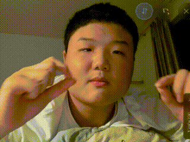

# 四指拉框 — Finger Rectangle

基于摄像头实时手势识别的互动视觉特效。双手伸出拇指和食指，四指构成一个矩形框，框内实时显示反转色效果；手指交叉时矩形平滑变形为 8 字形。

纯浏览器端运行，零后端依赖，单文件即开即用。
https://mmisitan0925-afk.github.io/four-finger-frame/
## 效果预览



> 用食指和大拇指在摄像头前比出矩形框，框内画面自动反转色；手指交叉时平滑变形为 8 字形（使用手机端演示帧数较低，推荐使用电脑端）

## 功能特性

| 功能 | 说明 |
|------|------|
| 实时手势追踪 | MediaPipe Hands 检测双手拇指+食指，四点构成矩形 |
| 反转色填充 | 框内摄像头画面颜色取反，框外正常显示 |
| 8 字变形 | 手指交叉时矩形平滑过渡为自交叉的 8 字形 |
| 跟手追踪 | lerp 直接插值，无惯性延迟，3 帧到位 |
| 渐隐动画 | 丢指后矩形平滑渐隐，不会突然消失 |
| 镜像翻转 | 一键切换摄像头镜像/非镜像模式 |
| 背景音乐 | 内嵌音乐循环播放，支持手动暂停 |
| 分辨率选择 | 320×240 / 640×480 / 1280×720 / 1920×1080 |

## 快速开始

1. 打开 `index.html`（需要 HTTPS 或 localhost 才能访问摄像头）
2. 允许摄像头权限
3. 双手伸出**拇指**和**食指**（左右手各两指，共 4 指）
4. 四指展开 → 矩形框出现
5. 手指交叉 → 矩形变 8 字
6. 收手 → 矩形渐隐消失

**右下角按钮：**

- `⇋` 镜像翻转
- `♫` 播放/暂停背景音乐
- `✕` 重置

**左下角**下拉菜单切换摄像头分辨率。

## 技术实现

### 技术栈

- HTML5 + CSS3 + Vanilla JavaScript (ES6+)
- [MediaPipe Hands](https://github.com/google-ai-edge/mediapipe) — 浏览器端手势识别（CDN WASM）
- Canvas 2D API — 图形渲染
- 零外部框架依赖

### 手部关键点

MediaPipe Hands 检测 21 个手部关键点，本项目使用其中两个：

| 关键点 | 索引 | 位置 |
|--------|------|------|
| 拇指尖 | `4` | THUMB_TIP |
| 食指尖 | `8` | INDEX_FINGER_TIP |

双手各取这两个点，共 4 个点构成矩形的 4 个角。

### 角点排列顺序

```
角0: 左手食指  ────→  角1: 右手食指
         ↑                    ↓
角3: 左手拇指  ←────  角2: 右手拇指
```

### 反转色原理

利用 Canvas compositing 实现，不涉及像素级操作：

```javascript
ctx.save();
ctx.clip(形状路径);           // 裁切到矩形/8字区域
ctx.drawImage(video, ...);   // 在裁切区域内画摄像头画面
ctx.globalCompositeOperation = 'difference';
ctx.fillStyle = '#fff';
ctx.fillRect(0, 0, W, H);   // 仅裁切区域内颜色取反
ctx.restore();               // 裁切解除，其余区域透明
```

效果层（反转色）和视频层（正常画面）分别在两个 Canvas 上绘制，通过 z-index 叠加。

### 8 字变形检测

通过检测两条对角线是否实际相交来判断手指是否交叉：

```javascript
// 对角线 [角0]-[角2] 与 [角1]-[角3] 的交点参数
// t, u ∈ (0.01, 0.99) → 中间段相交 → 确认交叉
const crossed = segmentsCross(cp[0], cp[2], cp[1], cp[3]);
```

- 交叉时：负面积幅度控制变形量，smoothMorph 平滑插值
- 分开时：变形量平滑归零，恢复矩形
- `morph > 0.5` 时路径从圆角矩形切换到自交叉四边形

### 坐标映射

MediaPipe 返回归一化坐标 (0~1)，需要经过三步转换：

1. 乘以视频原始分辨率 → 像素坐标
2. 按 `object-fit: cover` 计算缩放和偏移 → Canvas CSS 像素
3. 镜像处理：镜像 ON 由 CSS `transform: scaleX(-1)` 处理，镜像 OFF 手动翻转 `x = 1 - lm.x`

### 性能优化

- **帧采样**：每 2 帧送检一次 MediaPipe，渲染循环保持 60fps 独立运行
- **DPR 适配**：自动处理 Device Pixel Ratio，高清屏不模糊
- **内存管理**：及时清理过期轨迹点，页面卸载时释放摄像头流

## 浏览器兼容

| 浏览器 | 支持情况 |
|--------|----------|
| Chrome 90+ | ✅ 完全支持 |
| Edge 90+ | ✅ 完全支持 |
| Firefox 90+ | ✅ 完全支持 |
| Safari 15+ | ⚠️ 部分支持（WebGL delegate 可能不可用） |
| 移动端 Chrome | ✅ 支持（建议横屏使用） |

## 文件说明

```
├── index.html    ← 单文件，直接打开即可（~1.5MB，含内嵌音乐）
└── README.md     ← 本文件
```

整个项目只有一个 HTML 文件，音乐以 base64 编码内嵌，无任何外部资源依赖（MediaPipe WASM 运行时和模型通过 CDN 自动加载）。

## License

MIT
